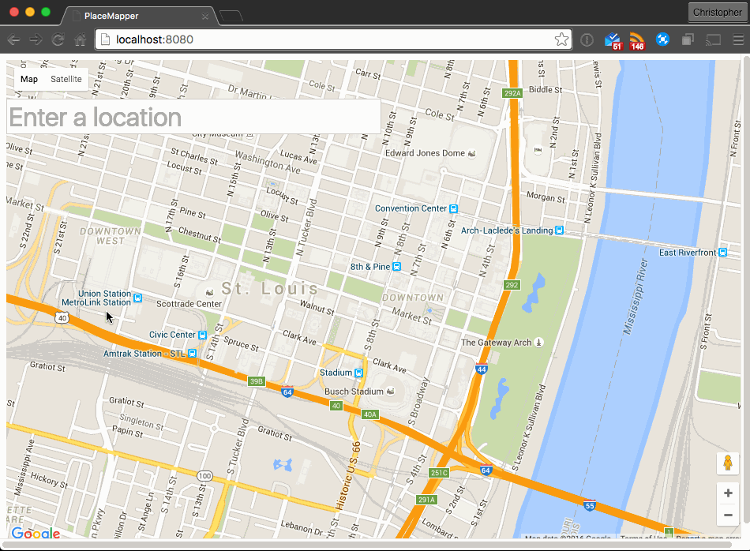

# PlaceMapper 2

PlaceMapper 2 is a demo implementation of the google maps API with the places library using Vue.js. The demo uses Webpack as the task runner and vue-loader to allow for separation of components.

_Don't ask about PlaceMapper 1, we don't talk about PlaceMapper 1. :P_

## Prerequisites

The only prerequisite for this project is [node.js](https://nodejs.org/en/). Pretty nice, huh?

## Get up and running

- Clone this repository:

        cd ~/Desktop
        git clone https://github.com/chris-schmitz/PlaceMapper2.git PlaceMapper2
        cd PlaceMapper2

- Install the dependencies:

        npm install

- Create a key file:

        touch src/PlaceMapper/keys.js

    - This module needs to export an object with a key of `key` and it's value is your google maps api key. e.g.:

            // src/PlaceMapper/keys.js
            module.exports = {
                key: 'YOURGOOGLEMAPSAPIKEYHERE'
            };

    - For details on how to generate an api key, see [google's instructions for generating an API key.](https://developers.google.com/maps/documentation/javascript/get-api-key)

- Start the webpack-dev-server via npm script:

        npm run dev

- Open a browser to `http://localhost:8080`
